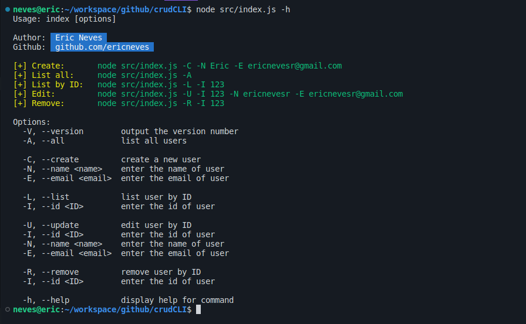

#### CRUD CLI


<p>CRUD CLI, projeto desenvolvido que consiste em fazer operações (<strong>CREATE, READ, UPDATE & DELETE</strong>) via <strong>Command Line Interface</strong>, basicamnte operando em informações armazenas em um arquivo local de formato <strong>JSON</strong>.</p>

<p>A aplicação foi desenvolvida com <strong>NodeJS</strong>, utilizando ferramentas como <strong>CommandJS</strong> para manipular os valores passados via <strong>CLI</strong> e <strong>MochaJS</strong> para efetuar testes de forma assíncrona e entre outras.</p>



#### Executando ⚙️

```sh

```

#### Ferramentas 🛠

   * NodeJS
     * Path
     * FS (fs/promises)
     * CommanderJS
     * MochaJS

#### License

